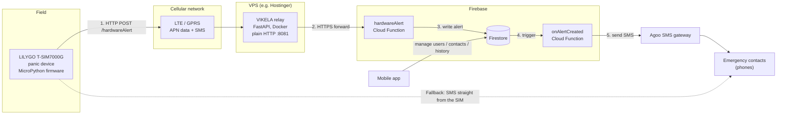
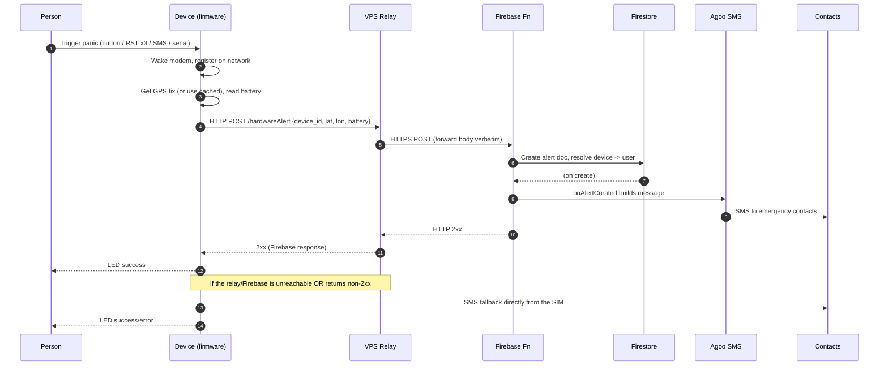
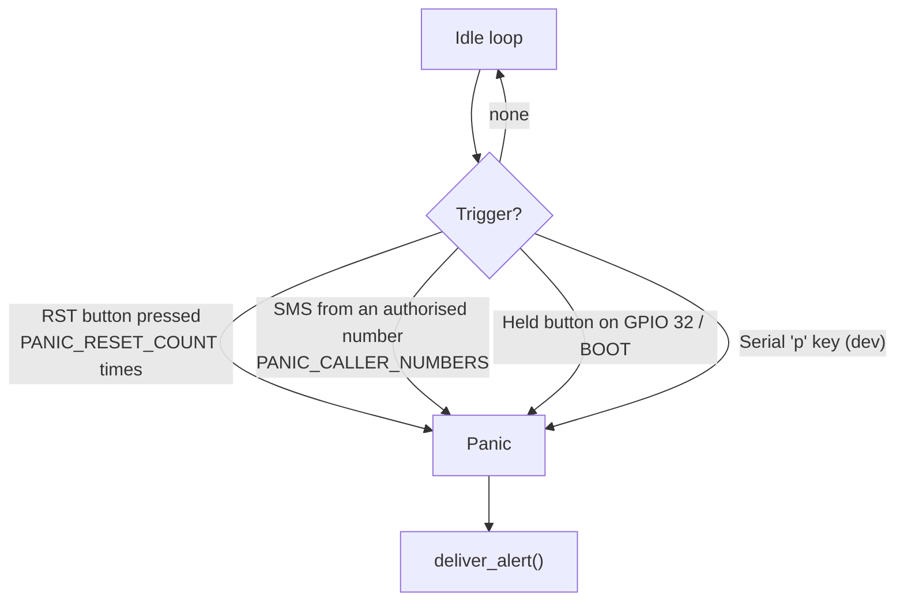
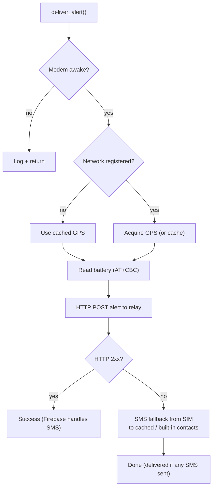
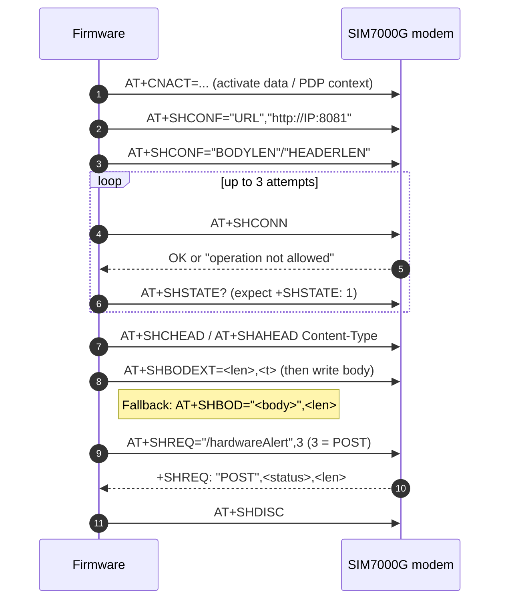
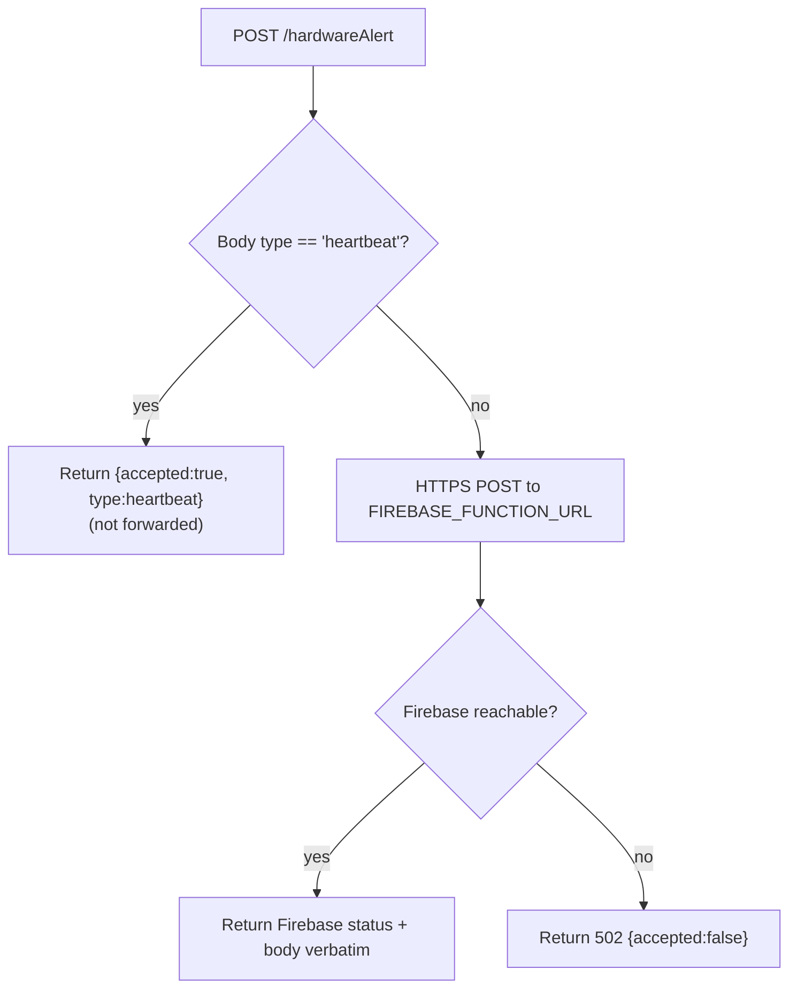
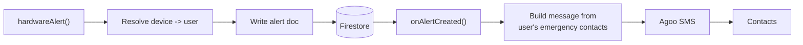
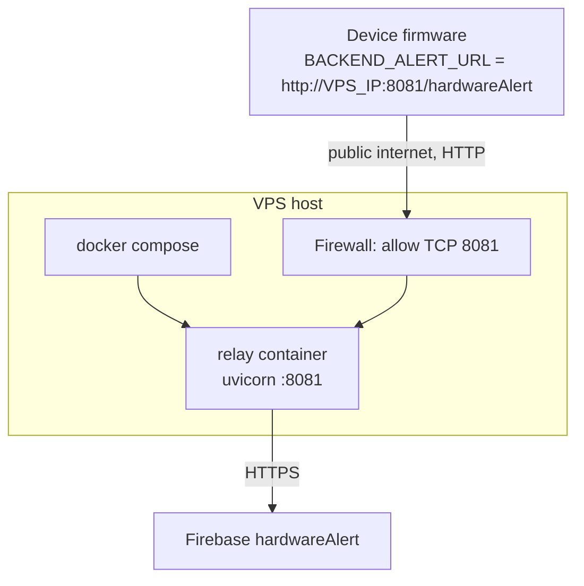

# VIKELA — System Architecture & Team Guide

A shared reference for how the VIKELA panic system works end to end: the hardware
device, the VPS relay, Firebase, and the SMS paths. Diagrams are Mermaid and
render automatically on GitHub.

> **This document describes the relay architecture** (branch
> `claude/vps-relay-firebase`): the device talks plain HTTP to a VPS relay, which
> forwards to Firebase over HTTPS. A separate branch
> (`claude/dev-branch-error-fix-38ew5o`) implements an alternative "native
> backend" that replaces Firebase entirely — see [Appendix B](#appendix-b--alternative-native-backend).

---

## 1. What VIKELA is

VIKELA is a community-safety system built around a **standalone hardware panic
button**. When a person triggers the device, it reports **who it is** and **where
it is**, and the backend alerts that person's **emergency contacts** by SMS.

The system has three parts:

| Part | Tech | Responsibility |
| --- | --- | --- |
| **Hardware device** | LILYGO T-SIM7000G (ESP32 + SIM7000G modem), MicroPython | Detect a panic, get GPS + battery, send the alert, SMS fallback |
| **VPS relay** | FastAPI + Docker on a VPS | Accept plain HTTP from the device, forward to Firebase over HTTPS |
| **Firebase** | Cloud Functions + Firestore | Resolve device → user, store the alert, send SMS via Agoo |
| **Mobile app** | (separate repo) | Manage users, contacts, device pairing, alert history |

### Why the relay exists

The SIM7000G modem **cannot reliably complete a TLS/HTTPS handshake**. Firebase
requires HTTPS. The relay bridges the gap: the device speaks plain **HTTP** to
the relay, and the relay speaks **HTTPS** to Firebase.

```
Hardware --HTTP--> VPS relay --HTTPS--> Firebase Cloud Function
```

---

## 2. System topology



**Two independent SMS paths:**
1. **Primary** — Firebase (`onAlertCreated`) sends SMS to the resolved contacts via Agoo.
2. **Fallback** — if the device can't reach the relay/Firebase, the firmware sends SMS **directly from its own SIM** to locally cached / built-in numbers.

---

## 3. End-to-end panic flow



---

## 4. The hardware device (firmware)

**File:** `firmware/micropython_lilygo_t_sim7000g_panic/main.py`
(MicroPython, single file, configured at the top before flashing.)

### 4.1 Panic triggers

The device needs no attached button to work. Any of these raise a panic:



| Trigger | Config | Notes |
| --- | --- | --- |
| RST multi-press | `PANIC_RESET_COUNT` (3), `RESET_MULTIPRESS_WINDOW_MS` | Counts qualifying resets via `machine.reset_cause()` + a flash counter |
| Remote SMS | `PANIC_CALLER_NUMBERS`, `PANIC_SMS_KEYWORD`, `REMOTE_TRIGGER_POLL_MS` | Polls the SIM inbox; whitelisted sender fires |
| Physical button | `PANIC_BUTTON_PINS` (`[32, 0]`), `BUTTON_HOLD_MS` | Hold to fire; debounced |
| Serial dev key | `DEV_SERIAL_TRIGGER_KEY` (`p`) | For bench testing without hardware |

### 4.2 Alert delivery logic



Key config at the top of `main.py`:

- `BACKEND_ALERT_URL = "http://YOUR_SERVER_IP:8081/hardwareAlert"` — the relay
- `CELLULAR_APN`, `DEVICE_ID`, `EMERGENCY_CONTACTS`, `SMSC_NUMBER`
- GPS/HTTP/network timeouts, trigger settings

### 4.3 How the modem sends HTTP (SIM7000G `AT+SH*` stack)

The firmware drives the modem with AT commands over UART. For a plain-HTTP POST:



**Modem quirks handled in firmware:**
- `AT+SHCONN` intermittently returns `operation not allowed` → **retried up to 3×** with a clean `AT+SHDISC` and a pause between attempts.
- The request body uses **`AT+SHBODEXT`** (length + `>` prompt, then raw bytes); some firmware only accepts the inline `AT+SHBOD="<body>",<len>` form, so that's a **fallback**.
- `AT+SHSSL`/`AT+SHDISC` `operation not allowed` before a session exists is harmless.

### 4.4 Data the device sends (contract)

`POST /hardwareAlert`, `Content-Type: application/json`:

```json
{
  "device_id": "VIKELA-T-SIM7000G-001",
  "latitude": 5.6037,
  "longitude": -0.187,
  "battery_level": 78
}
```

- `latitude`/`longitude` are `null` when GPS times out.
- `battery_level` is a percentage from `AT+CBC`, or `-1` if unavailable.
- The device only sends **who it is and where it is** — Firebase resolves the
  user and builds the emergency message.

---

## 5. The VPS relay

**Directory:** `relay/` &nbsp;•&nbsp; **File:** `relay/relay.py` (FastAPI)

Stateless HTTP→HTTPS forwarder. It does not store anything.



| Endpoint | Purpose |
| --- | --- |
| `GET /health` | Liveness check → `{"status":"ok"}` |
| `POST /hardwareAlert` | Forward alert to Firebase; heartbeats acked locally |

**Configuration (env):**

| Var | Default | Meaning |
| --- | --- | --- |
| `FIREBASE_FUNCTION_URL` | VIKELA `hardwareAlert` URL | HTTPS forward target |
| `RELAY_BIND` | `0.0.0.0:8081` | Public HTTP bind (port 80 fallback if a carrier blocks 8081) |
| `RELAY_FORWARD_TIMEOUT` | `30` | Seconds to wait for Firebase before returning 502 |

The relay returns **Firebase's real status and body** to the device, so the
device sees a true 2xx/non-2xx and can decide whether to fall back to SMS.

---

## 6. Firebase (backend of record)

Managed **outside this repo**. Responsibilities:

1. **`hardwareAlert` (HTTP Cloud Function)** — validates the payload, resolves
   `device_id` → user (via `devices/{deviceId}`), writes an alert document to
   Firestore.
2. **Firestore** — stores users, devices, emergency contacts, alert history;
   the mobile app reads/writes here.
3. **`onAlertCreated` (Firestore trigger)** — reads the user's emergency
   contacts, builds the message, and sends SMS via **Agoo**.



---

## 7. Deployment



**Steps (full runbook in `relay/README.md`):**

```bash
cd VIKELA/relay
cp .env.example .env            # set FIREBASE_FUNCTION_URL if different
docker compose up -d --build
curl http://127.0.0.1:8081/health     # {"status":"ok"}
# Open TCP 8081 in the VPS firewall (hPanel + ufw allow 8081/tcp)
```

Then set `BACKEND_ALERT_URL` in the firmware to
`http://<VPS_IP>:8081/hardwareAlert` and reflash the device.

> If a mobile carrier blocks port 8081, switch the relay to port 80
> (`RELAY_BIND=0.0.0.0:80`) — still plain HTTP, no TLS/Traefik.

---

## 8. Failure handling & resilience

| Failure | Behaviour |
| --- | --- |
| No GPS fix | Sends `latitude/longitude = null`; SMS says location unavailable; uses cached GPS when available |
| Network not registered | Uses cached GPS; attempts alert; falls back to SMS |
| `AT+SHCONN` "operation not allowed" | Retries up to 3× with disconnect + pause |
| Relay/Firebase unreachable or non-2xx | Device sends **SMS fallback** from its own SIM to cached / built-in contacts |
| Relay can't reach Firebase | Relay returns **502**; device falls back to SMS |
| SMS send fails (`CMS ERROR: 500`) | Set `SMSC_NUMBER` (SIM's service-centre number) |

---

## 9. Security notes (read before production)

- The device → relay path is **plain HTTP** and **unauthenticated**. Alert
  payloads (device ID + GPS) travel in the clear; anyone who knows the
  `IP:8081` can post to it. This is a deliberate trade-off for modem
  reliability. Mitigations to consider: a shared-secret header (device + relay),
  IP allow-listing, or moving the relay behind an authenticated gateway.
- Keep real phone numbers, APN credentials, and server IPs **out of git** — the
  firmware config constants use placeholders (`YOUR_SERVER_IP`); fill them in
  locally before flashing.

---

## 10. Repository map

```text
firmware/
  micropython_lilygo_t_sim7000g_panic/   # PRIMARY firmware (MicroPython)
    main.py                              #   single-file firmware
    README.md
  lilygo_t_sim7000g_panic/               # Arduino/TinyGSM alternative
relay/
  relay.py                               # FastAPI HTTP -> HTTPS forwarder
  Dockerfile, docker-compose.yml
  README.md                              # deploy runbook
  tests/                                 # respx-based tests
docs/
  ARCHITECTURE.md                        # this document
scripts/
  upload_micropython.sh                  # flash helper
```

---

## Appendix A — Glossary

| Term | Meaning |
| --- | --- |
| SIM7000G | The LTE/GPRS/GPS cellular modem on the board |
| `AT+SH*` | The SIM7000 modem's built-in HTTP client command set |
| CNACT | Modem command to activate the packet-data (PDP) context |
| Relay | The VPS service that forwards HTTP → HTTPS |
| Agoo | The SMS gateway Firebase uses to send messages (Ghana) |
| Heartbeat | An optional liveness ping (`{"type":"heartbeat"}`) acked by the relay |

## Appendix B — Alternative: native backend

Branch `claude/dev-branch-error-fix-38ew5o` replaces Firebase with a
**self-hosted FastAPI + SQLite backend** (`backend/`). In that design there is
**no relay and no Firebase**: the device posts directly to the backend, the
backend returns the emergency contacts, the **SIM sends the SMS**, and the device
**streams live GPS every 5 seconds** during an active panic (stoppable via a
resolve endpoint). Use that branch if you want to own the whole stack instead of
depending on Firebase. The two branches are mutually exclusive — pick one per
deployment.
